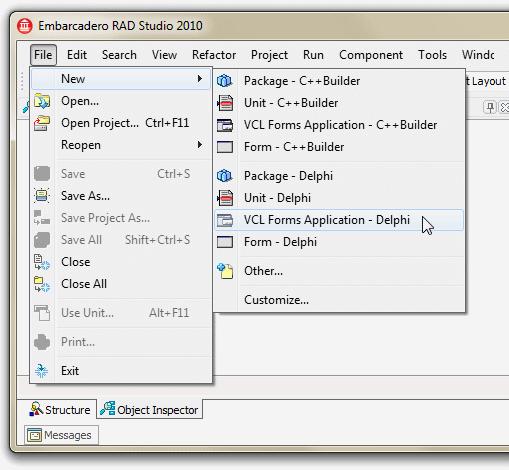

# 1일차

## **김원경** 강사

간단한 자기소개 및 실무에 관한 이야기 30분정도 진행 후 본격적인 수업 시작


강사님의 한마디 - **기본기가 확실해야 하며 정말 중요하다.**




```csharp
메모리의 효율적으로 사용하며 누수가 없어야 함
프로그램의 크기를 고려
가독성이 좋은 코딩
속도에 대한 퍼포먼스
사용자 접근성 고려
```



* 델파이 IDE -&gt; window 운영체제를 중심으로 돌아간다.

  * .exe -&gt; 실행파일               
  * .dll   -&gt; procedure 호출용
  * .ocx -&gt; import 하여 만들어내는 기법을 이용한 파일


FireMonkey 프레임워크 덕분에 맥에서도 사용가능 Win32, 64, Mac, ios, android 등


* 기초 교육은 Only Window 로만 진행하여 큰 틀부터 시작
  * TForm
  * TApplication
  * 컴포넌트 사용

## TApplication

> TApplication은 TComponent를 직접 상속받아 하나의 컴포넌트를 만들며 어플리케이션을 보좌

TApplication은 Form Unit안에서 선언되어 진다. TApplication의 인스턴스는 윈도우 API인 CreateWindow를 직접적으로 호출함으로써 하나의 윈도우를 탄생시킨다. 

그것은 Height = 0, Width = 0 크기의 윈도우를 만들어 내게 되므로 그 윈도우는 화면상에 그 형태를 드러내지 않으며, 이런 과정을 통해 TApplication은 메인폼을 생성하고 관리할 수 있게 된다. 

TApplication은 통상적인 컴포넌트들처럼 Property와 Event Handler를 가지고 있다.  


## TForm



```csharp
TForm = 클래스 ( TCustomForm );
```



```cpp
class  TForm : public  TCustomForm ;
```



![CLASS &#xACC4;&#xCE35; &#xAD6C;&#xC870;](data:image/png;base64,iVBORw0KGgoAAAANSUhEUgAABFMAAABLCAIAAAAzjF8jAAAKVklEQVR42u3dv87jxBoHYH/l6agAiVtANCy7tEhcAJfKBSDRssvSIG4BCajoKPck5Mjy8Xhej//F9vh5il0nGdvjefNnfnGS7+XDhw8vLy8NDLndPfbuAgAArOCeeX758H7vbnBQX768En4AAKiA5ENE8gEAoA7Tks9tHnzYmHTr26RjOaPnH6PkAwBAHUaSz2Oq3bZZPfl0t9/b19TtzOvYkp2uq+1JrjO7xE7JBwCAOkTJpzvVfixvMflO9xK3Gd3IurveWrvf0c5IPgAAMFs2+cST7+7HroLzNrlmuR31th9sp5sWemdLeh8Ji9cdPPDg0HLHMvvW9qZgHEY7064+tRujUUryAQCgDjOTT/di7mRF72xGyfmc9ARIb930+iaJDaN9C/pTvt8tLrbdWDgI8Y4Gxzmn26tnErcAAFjXonM+zdD5k5KpfG5HJUmju83cR8XSBsG6uQNcMfkEfY7zSW7FqdfHWw7uH3ud85n3N6bkJQAAcu7zy/f//Dx426v/fNXe9Fju/jvYIG2c22a8kd7CYON4a2kf0v4Efc7tt6RZ0IeSQys/2EnXx0ORc2t5ojgR56UTHQgAAKuLkk/z78T3sZBOytvrc8tBs6YzHc9tJ8gDQbPBPg/2Z7Bx2j6XfKauNXpouQSYrjj1+t7WckORuwNUExhyuaiaAwQAIHCfC777++3e3TiZ1x+9ucig3Y60+mDQS0TVHy8AwDVJPnNIPhUThAAAqnSf5L3946e9u8FBvfn064tP/QUhAIA6vNxmcvN+R4srMNHvEYQAAE7qxdQNZhOEAADOQvKB1bRByMMKAOBoJB9Yn3NBAABHI/nA5h5ByGMNAGBHkg88iRNBAAA7knxgH04EAQA8k+QDe/KjCAAAzyH5wCH4LBwAwKYkHzgin4UDAFiX5APH5bNwAABrkXzgBHwWDgBgIckHzsdn4QAAppJ84KzkHwCAcpIPnJvvAgEAlJB8oBJOAQEABO7Jp/flaWiZRp9O8FsIt5t6BfXYn2frx4W6tAz1ManLFajyYSnNbPfUc/vvlw/v9+4JB/Xlyyvh59TS56+2oGkQotCmQ6cuXYb6mNTlClT5sJRmydFJPkQkn2p0I9CjpnU/u23Kq87TGOpjUpcrUOXDUpolR1dV8rlN02s6nCOQfOoweOZn0rNb3U+FU1XzqrN7WUc7YKh3cZ26rN7tE3Velc9LaZYcXZR8HkHiYbs40e7ltovu8oztyDyrk3zqkPvMblDc3k/Grf5UmPs+0il+qm7HV511xyfY13MKdOS5145D3TbuLZRspOK6bPQHnQc3m54kL+x2ef5R5d2r3Gz5irPp3x+vuzRbD102+UwNEkuCR3fd3HZGty/5bEHyqUb6y2/x62vv60AbPc/2Npvud5eBKp+yrLK7ZkFdFvZzaoPdO7DEiYY6NyeetO7TertQeV2eNtubt6OpT5WqvG+Vm4lDOrVjZzktc8DSbL2jCcknzSfp6ZpHg3Q5bRNvubfi4Dbb5W5PBneUW5dRkk81yr/nM3h997W5Sd4W7b5JEzcL9hW/z5TbY24Xs28t+XHw1V91Ztel8Fh670b39rVRgco7YKgHhzr4t/AorlCXYJCbgieKYPxzOxotca5STfIMpsoHrHLuAZvuYvRVaeGBKM1GQ1f0abc08HRTR/emdCF3fW9Hs7fTJpncZuONE+tGSuozI/l0L+aeqiZ9eGPq61D8+ZAVLwZ65+KPUJfRQ2uGPka1dYEKO2CoB4c6/jcew1rr0mswOE8teaIYLXoQPEpKXP5Uo8p7VXnSkKY35Ya9188lB3Ll0mw6dEW/cJALIU0mqLQrbpR84u03yYmm9PqSo6Zxzqciy9/Xyb2tOPjCMGNfz0w+3e7NSz7Heb+t/MBLxnPdApV3wFDvlXxOXZepxzW16IMDEg/aMZOPKqcbLxnSkoXy4Z1xIEqzxdDdD/j9Pz/H4/LqP1892jwW2ovdW3ttcuvGC8Gts7c/uHEK3UZM8qnDS3Ii+HbNX3/+Ptj4408+a296LHf/HWyQNs5tM7duvKlcB0qa5S4Odmyw8+mxrPuqs7AuU4dr8GC3KNCkDhjqeKhL9lV3XdJeTT2u8vHv7SJePX2SnDrsqrxLlUeHNL6p8PqFB3LB0mw9dNnkc5vytsuDSaPbJo0c7fUlyaTbuHDFoNlgx3rLTUHeo5F8qhZM+5p/nx0eC+nTSnt9bjlo1hQ8wXUbt9eMvoRPXavbvR1fdRbWpXx8gvbPKVDc3lAvST4XqUvuLZXRw5w6/m2zwfEcLXHwVlFJB1T5OVWOh7QJX7ymDvu8A7lsabYeunvyeff32/IRef3Rm0ntObVbuSWfWt2e3X779d3evVjH51+8fuax3Ha36atONXVZzlAfk7os8eTnqyX9VOVjUprZbkM3LfmIPVcj+VSp/VxvNc9ukk+tDPUxqcs8t3FrzvPEq8qHpTSz/S/5vP3jp717wkG9+fRryacmL///+5s//vD93j06pW++/W7TVx11aRnqY1KXK1Dlw1Ka2W5D1/+lI+gSe6qR/n5L70rKbf24UJeWoT4mdbkCVT4spZntnnpMbeEKBpMPAMB1SD5Qv/TPfgEAXI1pEFRO2gEAaCQfqFj6F8oAAC5L8oE6OdUDANBlbgQVEnsAAHpMj6AqPuEGADBI8oFKyDwAAAHJB06v/Vs9Hs4AADmSD5ybUz0AACUkHzgxsQcAoJDkA6ck8wAATCL5wPmIPQAAU0k+cDL+Vg8AwAymUHAaTvUAAMx2Tz7tT+JCz9aTbPe9WDv+Mg8AwEKmU0Q2/WCVT22NegyR2AMAsJwZFRHJZ1/+RCkAwFpOmXzMmJ/mOMnnmkW/5lEDAGwhSj7d72A8YfrV+8pH7xsOvWt6/TFB3MiOyadX99V7kt7f5t3hjxMOAQAIZJPP1CnXWlO03na6F9vlGfsyg5xnxXFLv6wSbDyt+0YVHLyDLTzwwnVLmrnfAgCsZULyGZyMPi72voSdLqdtmkySiWef6X4Hd5f+IpbviM+zevJ5iBPs4PXde0uTv3c1Y3fCYF+5mN3rcO9A5j0WmqEouOn4AwBcXNGn3XLvvscnZHKNg4WmOPmU7Gutt/CvbOtfnZ6RfLoXS3JLfL4o3kK6naaTdkZ7Un7/DMbf/RYAYBVFZ0JKEkXvPfKHOPnE+2pmJZ/BXY/ulJzDnvMZ3EjuTli4r8G1uteUxJum+LEg+QAAPNN9ZvbXn7/HjT7+5LNHm8dCe7F7a69Nbt14IVi9ZAsl6zLJbdw2/Z5Prihp7YK7Wa5xbpvxurlu5C4Ge48fCyX3yRXHHwDg4rLJ5zblapeDONFt0J3YtdcvTD7pXnLXpLtuLw5OQymx6cw7SD5N8b1rcDlo1kxJPk3+zty7cuFjYZfxBwC4lHvy+e3Xd+UrfP7F60ntn+OYvarAbWA3TT6qFtt0/AEALmVa8jlmwDhmr+og+exL8gEAWMs9+fz4w/d7d4OD+ubb7zZNPu57sU3HHwDgUvo/iQZdW0+73fdiYg8AwFr+C6OCJM35pa5RAAAAAElFTkSuQmCC)

디자인 타임에 폼 디자이너에서 폼을 만들면 TForm의 자손으로 구현된다.

TForm에는 TButton, TCheckBox 및 TComboBox 등등 객체와 같은 다른 객체가 포함될 수 있다.  


## Delphi Source Files

### **dpr\(delphi project\) 프로젝트 파일** 

여러 개의 `pas 파일`과 `dfm 파일`의 정보를 가진다.

하나의 `exe 파일`으로 개발시에 `dpr 파일`은 반드시 하나만 존재


**dpr, dproj 차이점**

1. dpr &lt; dproj dproj 가 크기가 크다.

2. `.dpr 파일`은 소스 그 자체이다. 

3. 이전 델파이 옵션파일은 Test.Dof 텍스트로 저장

4.  옵션정보 및 프로젝트 정보를 다 저장한것이 `.dproj 파일`이다.


### **dpg\(delphi project group\) 프로젝트 그룹 파일**

 여러 개의 프로젝트 파일의 정보를 가지고 있다.여러 개의 프로젝트 파일을 관리할 때 사용하는 파일

### **pas\(pascal\) 유닛 파일**

하나의 폼에서 실행되는 처리 코드를 저장하는 `text 파일`


**무조건 pas 파일과 dfm 파일은 1:1 매칭을 이룬다.**


### dfm\(delphi form\) 폼 파일

하나의 폼에 관련된 모든 속성을 저장하는 `text 파일`


델파이4.0 까지는 바이너리 파일이었으나 5.0부터 텍스트 파일로 생성

`dfm 파일`을 에디터나 메모장으로 열어 수정하고 저장하면 에러 발생 

**반드시 델파이 상의 `Object Inspector` 를 이용하여 수정**


### dpk\(delphi package\) 델파이 패키지 파일

델파이 패키지 파일로 컴포넌트 소스인 .pas\(유닛파일\)를 하나로 합쳐 패키지로 만든파일 


**델파이에 컴포넌트를 쉽게 추가하기 위한 목적을 가진 패키지 파일**


### dcu 파일

델파이의 소스를 컴파일해서 생기는 object파일 이진파일

### bpl\(borland package library\)

패키지 라이브러리 파일

`다이나믹 링크 라이브러리(DLL) 파일`과 비슷하지만 `bpl 파일`은 볼랜드 제품에서만 호환됨

 `dll파일`은 MS 제품에서도 사용 가능

### dsk 델파이 환경설정 파일

`dpr 파일`과 파일명이 같으며 해당 프로그램의 환경설정 내용을 가지고 있는 파일

**삭제하더라도 프로그램 컴파일 시 자동으로 만들어지는 파일**

## New Vcl Forms Application

* New Console App -&gt; 헬로우월드
* New Service App -&gt; 통신프로그램, 자동업데이트
* New Vcl Forms App -&gt; 해당 Application 으로 진행





C++ 로 만들어질 수 있으니 주의



